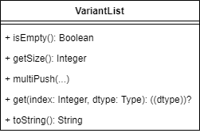

# Variant List

Your task is to implement a variant list, which can store elements of different type. The list is modelled by the following UML class.

<p align="center">
</img>
</p>
<p align="center">
UML Class
</p>

It is not exactly how it is implemented in C, because in C there are no classes. Instead the methods are implemented as free standing functions, so called free functions. Usually those free functions are named in the following naming scheme:

    <TypeName>_<method> or <TypeName><Method>

Constructors and Destructors (known from C++) are also defined as free functions. Usually all functions take the instance as the first paramter, except the constructor itself.

The exact interface, which is defined in the header, should be the following


```c
#pragma once
#include <stdbool.h>    // bool
#include <stdlib.h>     // size_t

typedef struct VariantList VariantList;

typedef enum {
    DT_INTEGER,
    DT_BOOLEAN,
    DT_FLOAT,
    DT_STRING,

    DT_NONE
} DType;

VariantList* VariantList_Create(void);
void VariantList_Destroy(VariantList* list);

bool VariantList_IsEmpty(VariantList* list);
size_t VariantList_GetSize(VariantList* list);
bool VariantList_MultiPush(VariantList* list, ...);
DType VariantList_Get(VariantList* list, size_t index, DType dtype, void* dst);
bool VariantList_ToString(VariantList* list, char* buffer, size_t buffer_size);

#define VariantList_ManyPush(list, ...) /*TODO*/
```

## `VariantList_Create`
`VariantList_Create` should allocate memory for an empty variant list. If it fails to allocate, it should return `NULL`.

## `VariantList_Destroy`
`VariantList_Destroy` should free all resources of the list itself and the contained elements. It is undefined behavior if `list` is `NULL`.

## `VariantList_IsEmpty`
`VariantList_IsEmpty` returns if there are no elements in the list.
It is undefined behavior if `list` is `NULL`.

## `VariantList_GetSize`
`VariantList_GetSize` returns how many elements are in the list.
It is undefined behavior if `list` is `NULL`.

## `VariantList_MultiPush`
`VariantList_MultiPush` reads multiple pairs of type and value. The type determines how the value is interpreted. If the type is `DT_NONE` no more values are read. Note that for strings a copy of the string is created. If an error occurs, it should return `false`, otherwise `true` on success. It is undefined behavior if `list` is `NULL`, or if the argument list is not finished with `DT_NONE` in an odd position. 

## `VariantList_Get`
`VariantList_Get` tries to read the element at the given index as the given type into `dst`. Note that for strings no copy of the string is created. If the element at the given index is not of the requested type, just the type is returned. If the element at the given index matches the requested type, the element is also written into dst. It is undefined behavior if `list` is `NULL`, or if the object pointed to by dst is NULL or does not match the requested type. It is also undefined behavior if index is outside of the range `[0, size)`. When `dtype = DT_NONE`, dst is ignored. This can be used whenever the type of the element should be determined.

## `VariantList_ToString`
`VariantList_ToString` converts the contents of the list to a human readable form. It starts with the character '[' and ends with ']'. In between the values are separated by ','. Strings are inserted inside " ". Boolean values are inserted by their macro names defined in `<stdbool.h>`. Numbers are inserted in decimal. The resulting string is written to `buffer`, wich has the size of at least `buffer_size`. If the contents do not fit into the buffer `false` is returned, otherwise `true` is returned. It is undefined behavior if `list` is `NULL`, or if `buffer_size` is larger than the actual size of `buffer`.


The following could be relevant for finishing this task:

- `<stdarg.h>`
- `union`
- `switch`
- `malloc`, `calloc`, `free`


## Extra
Write a macro with the same functionality as `VariantList_MultiPush` but without any need to write `DT_NONE` at the end. The macro should be defined in the header. Call this macro `VariantList_ManyPush`.